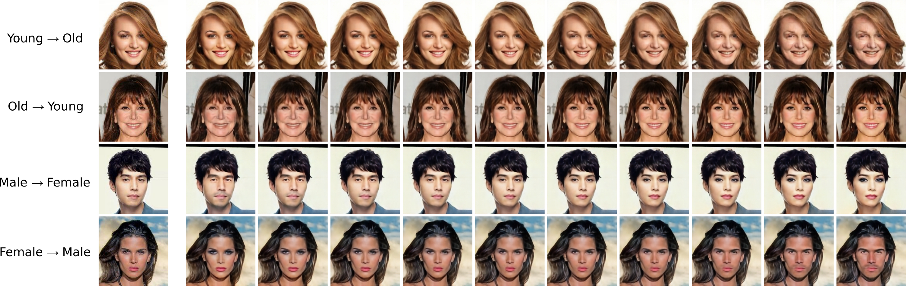
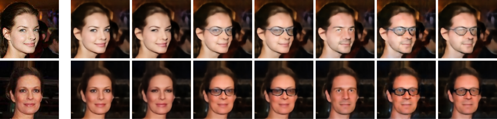
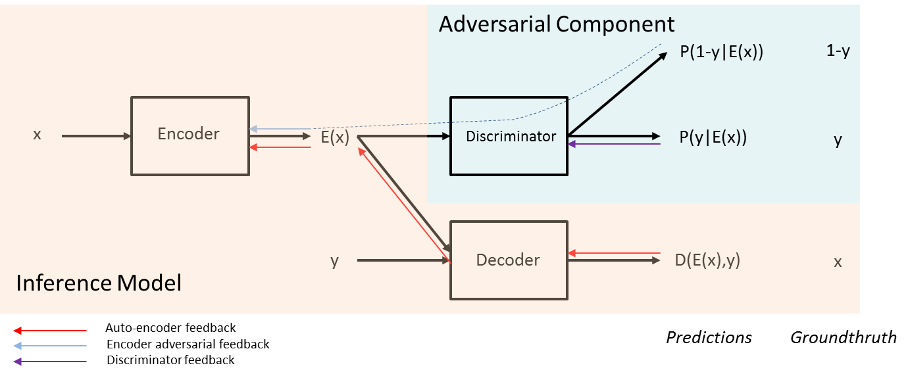

# FaderNetworks

PyTorch implementation of [Fader Networks](https://arxiv.org/pdf/1706.00409.pdf) (NIPS 2017).

<p align="center"><a href=https://github.com/facebookresearch/FaderNetworks/blob/master/images/interpolation.jpg?raw=true></a></p>

Fader Networks can generate different realistic versions of images by modifying attributes such as gender or age group. They can swap multiple attributes at a time, and continuously interpolate between each attribute value. In this repository we provide the code to reproduce the results presented in the paper, as well as trained models.

### Single-attribute swap

Below are some examples of different attribute swaps:

<p align="center"><a href=https://github.com/facebookresearch/FaderNetworks/blob/master/images/swap.jpg?raw=true></a></p>

### Multi-attributes swap

The Fader Networks are also designed to disentangle multiple attributes at a time:

<p align="center"><a href=https://github.com/facebookresearch/FaderNetworks/blob/master/images/multi_attr.jpg?raw=true></a></p>

## Model

<p align="center"><a href=https://github.com/facebookresearch/FaderNetworks/blob/master/images/v3.png?raw=true></a></p>

The main branch of the model (Inference Model), is an autoencoder of images. Given an image `x` and an attribute `y` (e.g. male/female), the decoder is trained to reconstruct the image from the latent state `E(x)` and `y`. The other branch (Adversarial Component), is composed of a discriminator trained to predict the attribute from the latent state. The encoder of the Inference Model is trained not only to reconstruct the image, but also to fool the discriminator, by removing from `E(x)` the information related to the attribute. As a result, the decoder needs to consider `y` to properly reconstruct the image. During training, the model is trained using real attribute values, but at test time, `y` can be manipulated to generate variations of the original image.

## Dependencies
* Python 2/3 with [NumPy](http://www.numpy.org/)/[SciPy](https://www.scipy.org/)
* [PyTorch](http://pytorch.org/)
* OpenCV
* CUDA


## Installation

Simply clone the repository:

```bash
git clone https://github.com/facebookresearch/FaderNetworks.git
cd FaderNetworks
```

## Dataset
Download the aligned and cropped CelebA dataset from http://mmlab.ie.cuhk.edu.hk/projects/CelebA.html. Extract all images and move them to the `data/img_align_celeba/` folder. There should be 202599 images. The dataset also provides a file `list_attr_celeba.txt` containing the list of the 40 attributes associated with each image. Move it to `data/`. Then simply run:

```batch
cd data
./preprocess.py
```

It will resize images, and create 2 files: `images_256_256.pth` and `attributes.pth`. The first one contains a tensor of size `(202599, 3, 256, 256)` containing the concatenation of all resized images. Note that you can update the image size in `preprocess.py` to work with different resolutions. The second file is a pre-processed version of the attributes.

## Pretrained models
You can download pretrained classifiers and Fader Networks by running:

```batch
cd models
./download.sh
```

## Train your own models

### Train a classifier
To train your own model you first need to train a classifier to let the model evaluate the swap quality during the training. Training a good classifier is relatively simple for most attributes, and a good model can be trained in a few minutes. We provide a trained classifier for all attributes in `models/classifier256.pth`. Note that the classifier does not need to be state-of-the-art, it is not used during the training process, but is just here to monitor the swap quality. If you want to train your own classifier, you can run `classifier.py`, using the following parameters:


```bash
python classifier.py

# Main parameters
--img_sz 256                  # image size
--img_fm 3                    # number of feature maps
--attr "*"                    # attributes list. "*" for all attributes

# Network architecture
--init_fm 32                  # number of feature maps in the first layer
--max_fm 512                  # maximum number of feature maps
--hid_dim 512                 # hidden layer size

# Training parameters
--v_flip False                # randomly flip images vertically (data augmentation)
--h_flip True                 # randomly flip images horizontally (data augmentation)
--batch_size 32               # batch size
--optimizer "adam,lr=0.0002"  # optimizer
--clip_grad_norm 5            # clip gradient L2 norm
--n_epochs 1000               # number of epochs
--epoch_size 50000            # number of images per epoch

# Reload
--reload ""                   # reload a trained classifier
--debug False                 # debug mode (if True, load a small subset of the dataset)
```


### Train a Fader Network

You can train a Fader Network with `train.py`. The autoencoder can receive feedback from:
- The image reconstruction loss
- The latent discriminator loss
- The PatchGAN discriminator loss
- The classifier loss

In the paper, only the first two losses are used, but the two others could improve the results further. You can tune the impact of each of these losses with the lambda_ae, lambda_lat_dis, lambda_ptc_dis, and lambda_clf_dis coefficients. Below is a complete list of all parameters:

```bash
# Main parameters
--img_sz 256                      # image size
--img_fm 3                        # number of feature maps
--attr "Male"                     # attributes list. "*" for all attributes

# Networks architecture
--instance_norm False             # use instance normalization instead of batch normalization
--init_fm 32                      # number of feature maps in the first layer
--max_fm 512                      # maximum number of feature maps
--n_layers 6                      # number of layers in the encoder / decoder
--n_skip 0                        # number of skip connections
--deconv_method "convtranspose"   # deconvolution method
--hid_dim 512                     # hidden layer size
--dec_dropout 0                   # dropout in the decoder
--lat_dis_dropout 0.3             # dropout in the latent discriminator

# Training parameters
--n_lat_dis 1                     # number of latent discriminator training steps
--n_ptc_dis 0                     # number of PatchGAN discriminator training steps
--n_clf_dis 0                     # number of classifier training steps
--smooth_label 0.2                # smooth discriminator labels
--lambda_ae 1                     # autoencoder loss coefficient
--lambda_lat_dis 0.0001           # latent discriminator loss coefficient
--lambda_ptc_dis 0                # PatchGAN discriminator loss coefficient
--lambda_clf_dis 0                # classifier loss coefficient
--lambda_schedule 500000          # lambda scheduling (0 to disable)
--v_flip False                    # randomly flip images vertically (data augmentation)
--h_flip True                     # randomly flip images horizontally (data augmentation)
--batch_size 32                   # batch size
--ae_optimizer "adam,lr=0.0002"   # autoencoder optimizer
--dis_optimizer "adam,lr=0.0002"  # discriminator optimizer
--clip_grad_norm 5                # clip gradient L2 norm
--n_epochs 1000                   # number of epochs
--epoch_size 50000                # number of images per epoch

# Reload
--ae_reload ""                    # reload pretrained autoencoder
--lat_dis_reload ""               # reload pretrained latent discriminator
--ptc_dis_reload ""               # reload pretrained PatchGAN discriminator
--clf_dis_reload ""               # reload pretrained classifier
--eval_clf ""                     # evaluation classifier (trained with classifier.py)
--debug False                     # debug mode (if True, load a small subset of the dataset)
```

## Generate interpolations

Given a trained model, you can use it to swap attributes of images in the dataset. Below are examples using the pretrained models:

```bash
# Narrow Eyes
python interpolate.py --model_path models/narrow_eyes.pth --n_images 10 --n_interpolations 10 --alpha_min 10.0 --alpha_max 10.0 --output_path narrow_eyes.png

# Eyeglasses
python interpolate.py --model_path models/eyeglasses.pth --n_images 10 --n_interpolations 10 --alpha_min 2.0 --alpha_max 2.0 --output_path eyeglasses.png

# Age
python interpolate.py --model_path models/young.pth --n_images 10 --n_interpolations 10 --alpha_min 10.0 --alpha_max 10.0 --output_path young.png

# Gender
python interpolate.py --model_path models/male.pth --n_images 10 --n_interpolations 10 --alpha_min 2.0 --alpha_max 2.0 --output_path male.png

# Pointy nose
python interpolate.py --model_path models/pointy_nose.pth --n_images 10 --n_interpolations 10 --alpha_min 10.0 --alpha_max 10.0 --output_path pointy_nose.png
```

These commands will generate images with 10 rows of 12 columns with the interpolated images. The first column corresponds to the original image, the second is the reconstructed image (without alteration of the attribute), and the remaining ones correspond to the interpolated images. `alpha_min` and `alpha_max` represent the range of the interpolation. Values superior to 1 represent generations over the True / False range of the boolean attribute in the model. Note that the variations of some attributes may only be noticeable for high values of alphas. For instance, for the "eyeglasses" or "gender" attributes, alpha_max=2 is usually enough, while for the "age" or "narrow eyes" attributes, it is better to go up to alpha_max=10.


## References

If you find this code useful, please consider citing:

[*Fader Networks: Manipulating Images by Sliding Attributes*](https://arxiv.org/pdf/1706.00409.pdf) - G. Lample, N. Zeghidour, N. Usunier, A. Bordes, L. Denoyer, M'A. Ranzato

```
@inproceedings{lample2017fader,
  title={Fader Networks: Manipulating Images by Sliding Attributes},
  author={Lample, Guillaume and Zeghidour, Neil and Usunier, Nicolas and Bordes, Antoine and DENOYER, Ludovic and others},
  booktitle={Advances in Neural Information Processing Systems},
  pages={5963--5972},
  year={2017}
}
```

Contact: [gl@fb.com](mailto:gl@fb.com), [neilz@fb.com](mailto:neilz@fb.com)
